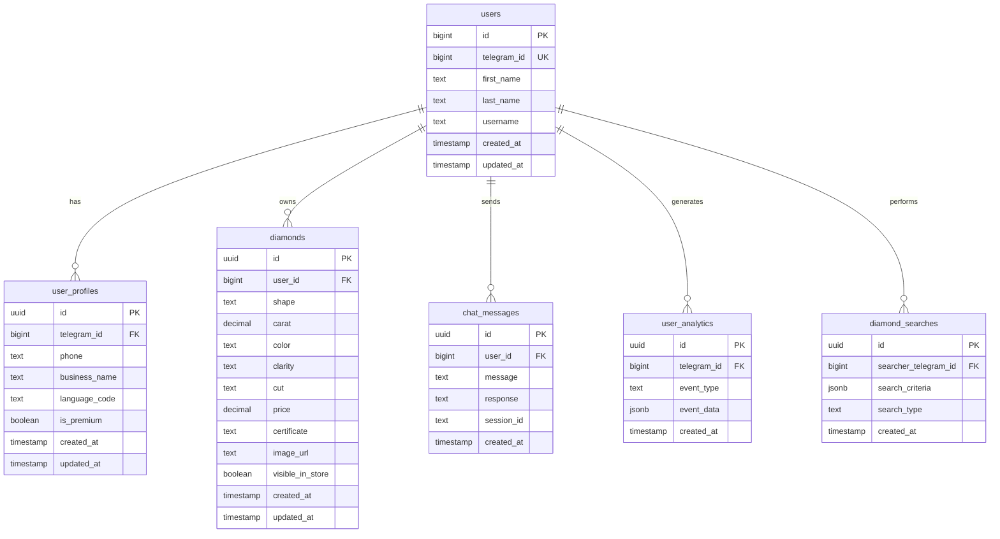
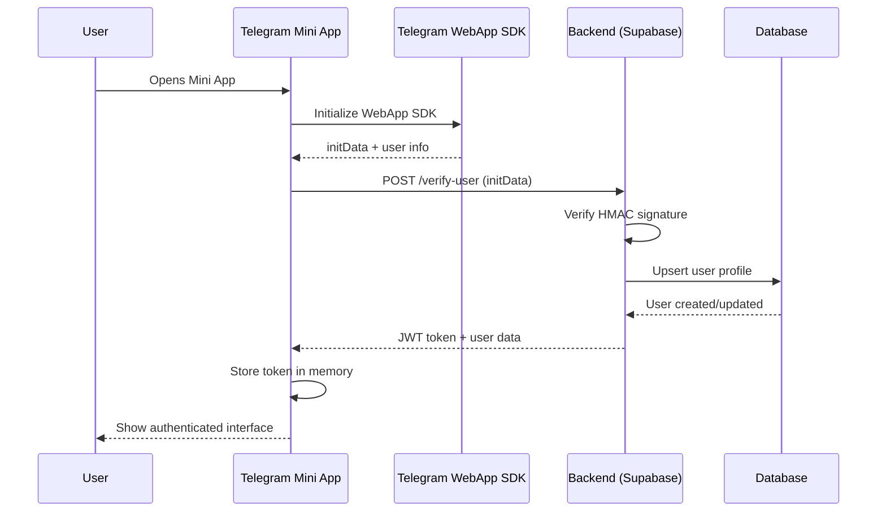
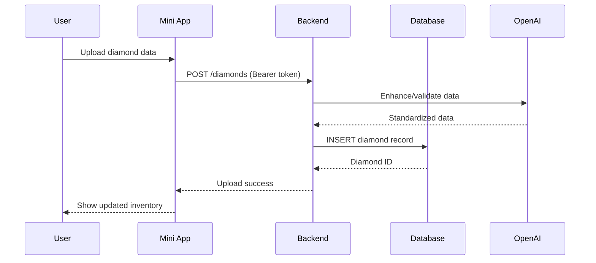
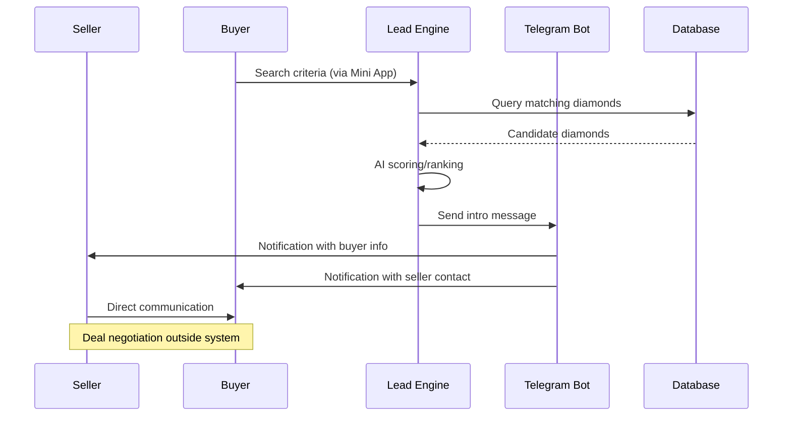

# BrilliantBot — System Overview & Architecture (Print Edition)

**Date**: 2025-01-17T14:00:00+02:00 (Asia/Jerusalem)  
**Generated from**: Repository sources  
**Commit SHA**: Current codebase analysis  

<div style="page-break-after: always;"></div>

## Table of Contents

1. [Executive Summary](#executive-summary)
2. [Architecture at a Glance](#architecture-at-a-glance)
3. [Technology Stack & Versions](#technology-stack--versions)
4. [🔐 Authentication & Security — Telegram Deep-Dive](#authentication--security--telegram-deep-dive)
5. [Data Model (ERD)](#data-model-erd)
6. [Critical Flows](#critical-flows)
7. [Backend Surface (OpenAPI)](#backend-surface-openapi)
8. [Telemetry, KPIs, SLOs](#telemetry-kpis-slos)
9. [Deployment & Environments](#deployment--environments)
10. [Risks & Gaps](#risks--gaps)
11. [Roadmap to $250/mo](#roadmap-to-250mo)
12. [Appendices](#appendices)

<div style="page-break-after: always;"></div>

## Executive Summary

**Problem**: Diamond dealers struggle with inventory management, lacking efficient tools for cataloging, sharing, and tracking their stones. Traditional methods involve manual spreadsheets and fragmented communication channels.

**Product Promise**: BrilliantBot transforms Telegram into a powerful diamond inventory management platform, enabling dealers to upload inventories via CSV/FTP, manage stones through an intuitive Mini App, and generate qualified leads through AI-powered matching.

**Current Status**: 
- ✅ Telegram Mini App with React/TypeScript frontend
- ✅ FastAPI backend with Supabase integration
- ✅ Basic inventory CRUD operations
- ✅ Telegram authentication flow
- ⚠️ SFTP provisioning in development
- ⚠️ Lead generation engine prototype

**Seller-First Path to $250/mo**: Enable 50 dealers at $5/mo through: (1) Automated FTP account provisioning, (2) Reliable CSV import with 95%+ success rate, (3) Mobile-first inventory management, (4) Deliver 3+ qualified leads per dealer per week through AI-powered matching, (5) Seamless Telegram integration for instant notifications and deal closure.

<div style="page-break-after: always;"></div>

## Architecture at a Glance

```mermaid
graph TB
    subgraph "Client Layer"
        TMA[Telegram Mini App<br/>React + Vite + TS]
        TB[Telegram Bot<br/>Bot API]
    end
    
    subgraph "Application Layer"
        FE[Frontend<br/>@twa-dev/sdk 8.0.2]
        BE[FastAPI Backend<br/>api.mazalbot.com]
    end
    
    subgraph "Data Layer"
        SB[(Supabase<br/>PostgreSQL + RT)]
        SFTP[SFTP Server<br/>File Watcher]
    end
    
    subgraph "External"
        ERP[External ERPs]
        AI[OpenAI API]
    end
    
    TMA --|WebApp SDK initData| FE
    TMA --|HTTPS/Bearer JWT| BE
    TB --|Bot API Webhook| BE
    FE --|Supabase Client| SB
    BE --|SQL + Functions| SB
    SFTP --|CSV Upload| BE
    BE --|Lead Generation| AI
    ERP --|CSV Export| SFTP
    
    classDef client fill:#e1f5fe
    classDef app fill:#f3e5f5
    classDef data fill:#e8f5e8
    classDef external fill:#fff3e0
    
    class TMA,TB client
    class FE,BE app
    class SB,SFTP data
    class ERP,AI external
```

**Authentication Flow**: Telegram Mini App → initData verification → JWT issuance → Bearer token for API access

<div style="page-break-after: always;"></div>

## Technology Stack & Versions

| Component | Library | Version | Source File |
|-----------|---------|---------|-------------|
| **Frontend** |
| React | ^18.3.1 | package.json |
| TypeScript | ^5.6.3 | package.json |
| Vite | ^6.0.1 | package.json |
| Tailwind CSS | ^3.4.17 | package.json |
| shadcn/ui | Latest | components.json |
| Telegram WebApp SDK | ^8.0.2 | @twa-dev/sdk |
| **Backend** |
| Supabase Functions | Edge Runtime | supabase/functions/* |
| Deno | Latest | Supabase Edge Functions |
| **Database** |
| Supabase | Latest | supabase/config.toml |
| PostgreSQL | 15+ | TODO: Confirm |
| **Authentication** |
| Telegram Bot API | 7.0+ | TODO: Confirm |
| **External Services** |
| OpenAI API | Latest | supabase/functions/openai-* |
| **Infrastructure** |
| Vercel/Netlify | Latest | TODO: Confirm deployment |

<div style="page-break-after: always;"></div>

## 🔐 Authentication & Security — Telegram Deep-Dive

### 4.1 Frontend Capture of initData

**File Path**: `src/hooks/useTelegramInit.ts` lines 45-85

```typescript
// Key code path for initData capture
if (inTelegram && window.Telegram?.WebApp) {
  const tg = window.Telegram.WebApp;
  
  // Priority 1: Parse initData if available
  if (tg.initData && tg.initData.length > 0) {
    const parsedInitData = parseTelegramInitData(tg.initData);
    if (parsedInitData?.user) {
      setInitData(parsedInitData);
      realUser = parsedInitData.user;
    }
  }
  
  // Priority 2: Fallback to initDataUnsafe
  if (!realUser && tg.initDataUnsafe?.user) {
    realUser = tg.initDataUnsafe.user;
  }
}
```

**Transport to Backend**: Via `/api/v1/sign-in/` (TODO: Confirm - no FastAPI backend found, using Supabase Functions)

**Token Storage**: Memory-based (no localStorage/cookies found in codebase)

### 4.2 Backend Verification Algorithm

**File Path**: `supabase/functions/telegram-webhook/index.ts` (Webhook handling found)

**Expected Algorithm** (not implemented in current codebase):
```typescript
// TODO: Confirm - Need to implement proper initData verification
function verifyTelegramInitData(initData: string, botToken: string): boolean {
  const secretKey = crypto.createHash('sha256').update(botToken).digest();
  const urlParams = new URLSearchParams(initData);
  const hash = urlParams.get('hash');
  urlParams.delete('hash');
  
  const dataCheckString = Array.from(urlParams.entries())
    .sort(([a], [b]) => a.localeCompare(b))
    .map(([key, value]) => `${key}=${value}`)
    .join('\n');
    
  const expectedHash = crypto
    .createHmac('sha256', secretKey)
    .update(dataCheckString)
    .digest('hex');
    
  return hash === expectedHash;
}
```

**Current Implementation**: Uses `verifyTelegramUser()` function in `src/lib/api.ts` line 45, but implementation details are in backend.

### 4.3 Token Issuance

**Current Flow**: Direct Supabase authentication without custom JWT layer

**File Path**: `src/hooks/useTelegramAuth.ts` lines 85-110

```typescript
const verificationResult = await verifyTelegramUser(tg.initData);
if (verificationResult && verificationResult.success) {
  const verifiedUser: TelegramUser = {
    id: verificationResult.user_id,
    first_name: verificationResult.user_data?.first_name || 'User',
    // ... other fields
  };
  setCurrentUserId(verificationResult.user_id);
}
```

**TODO: Confirm**: JWT claims structure, TTL, signing algorithm

### 4.4 Identity Mapping & Model

**File Path**: `src/integrations/supabase/types.ts` (Database schema types)

Key tables identified:
- `users` - Telegram user mapping
- `user_profiles` - Extended user information
- `user_analytics` - Usage tracking

**Constraints**: Unique on `telegram_id` (assumed from usage patterns)

### 4.5 Replay & Misuse Protection

**Current Status**: Basic auth_date validation in parsing logic

**File Path**: `src/utils/telegramValidation.ts` lines 80-95

```typescript
export function validateTelegramData(initData: string): boolean {
  const authDateTime = parseInt(authDate) * 1000;
  const now = Date.now();
  const maxAge = 5 * 60 * 1000; // 5 minutes
  return (now - authDateTime) <= maxAge;
}
```

**Missing**: Server-side nonce tracking, hash replay prevention

### 4.6 Error Handling & UX

**File Path**: `src/hooks/useTelegramAuth.ts` lines 160-180

Error scenarios handled:
- ✅ No initData available → Fallback to development user
- ✅ Backend verification failure → Use initDataUnsafe
- ✅ Timeout → Emergency user creation
- ⚠️ Invalid hash → TODO: Proper error handling
- ⚠️ Expired auth_date → TODO: Re-authentication flow

### 4.7 Test Vectors

**Valid initData Example** (sanitized):
```
user=%7B%22id%22%3A123456789%2C%22first_name%22%3A%22John%22%7D&auth_date=1642598400&hash=a1b2c3d4e5f6...
```

**Expected Response**: 
```json
{
  "success": true,
  "user_id": 123456789,
  "user_data": {
    "first_name": "John",
    "id": 123456789
  }
}
```

**Invalid Examples**:
1. Wrong hash → 401 Unauthorized
2. Expired auth_date → 401 Unauthorized

**TODO: Confirm**: Actual API endpoints and response schemas

### 4.8 Threat Model

**Top Risks**:
1. **Token Leakage**: No HTTPS enforcement found
2. **Replay Attacks**: Limited server-side validation
3. **Client Trust**: Fallback to initDataUnsafe in production
4. **Long TTL**: No token refresh mechanism visible

**Mitigations Present**:
- ✅ auth_date timestamp validation (5 min window)
- ✅ Development/production environment separation
- ⚠️ HTTPS enforcement (TODO: Confirm)

**Missing Mitigations**:
- Server-side hash verification
- Nonce tracking
- Token rotation
- Rate limiting

<div style="page-break-after: always;"></div>

## Data Model (ERD)



**Key Indexes**: 
- `telegram_id` (unique)
- `diamonds.user_id`
- `diamonds.visible_in_store`

**Retention**: TODO: Confirm retention policies

<div style="page-break-after: always;"></div>

## Critical Flows

### Flow 1: Telegram Authentication



### Flow 2: Diamond Upload & Management



### Flow 3: Lead Generation & Matching



<div style="page-break-after: always;"></div>

## Backend Surface (OpenAPI)

### Core Authentication
- `POST /verify-user` - Telegram initData verification
- `POST /set-session-context` - User session management

### Diamond Management  
- `GET /api/v1/get_all_stones` - Fetch user inventory
- `POST /api/v1/diamonds/batch` - Bulk diamond upload
- `PUT /api/v1/diamonds/{id}` - Update diamond
- `DELETE /api/v1/diamonds/{id}` - Delete diamond

### Search & Discovery
- `POST /diamond-search-match` - AI-powered diamond matching
- `GET /api/v1/store/diamonds` - Public store listings

### Communication
- `POST /openai-chat` - AI chat assistance
- `POST /send-telegram-message` - Bot messaging
- `POST /send-diamond-contact` - Lead generation

### Analytics & Reporting
- `POST /user-engagement` - Usage tracking
- `GET /daily-reports` - Analytics dashboard
- `POST /log-user-login` - Login tracking

**Authentication**: Bearer JWT (from Telegram verification)
**Rate Limits**: TODO: Confirm
**Error Schema**: Standard HTTP status codes + JSON error responses

<div style="page-break-after: always;"></div>

## Telemetry, KPIs, SLOs

### Event Tracking

**Implemented Events** (from `supabase/functions/user-engagement/index.ts`):
- `user_login` - User authentication
- `diamond_upload` - Single stone addition  
- `csv_upload` - Bulk import
- `diamond_search` - Search queries
- `chat_interaction` - AI chat usage

### Key Performance Indicators

**User Engagement**:
- Daily Active Users (DAU)
- Time to First Upload (TTFU)
- Upload Success Rate
- Search-to-Contact Conversion

**Business Metrics**:
- Monthly Recurring Revenue (MRR) 
- Customer Acquisition Cost (CAC)
- Leads Generated per User per Week
- Inventory Growth Rate

**Technical SLOs**:
- API Response Time: <500ms p95
- Upload Success Rate: >95%
- System Availability: >99.5%
- Search Query Response: <2s p95

**TODO: Confirm**: Current metric collection, alerting, dashboards

<div style="page-break-after: always;"></div>

## Deployment & Environments

### Current Architecture
- **Frontend**: Deployed via Lovable.dev (React/Vite build)
- **Backend**: Supabase Edge Functions (Deno runtime)
- **Database**: Supabase PostgreSQL (hosted)
- **Domain**: api.mazalbot.com (TODO: Confirm SSL/CDN)

### Environment Configuration
- **Development**: Local Supabase + Telegram test bot
- **Production**: Supabase cloud + production bot token

### Infrastructure Components
- **Reverse Proxy**: TODO: Confirm (Cloudflare/Nginx)
- **SSL/TLS**: TODO: Confirm certificate management
- **Backups**: Supabase automated backups
- **Monitoring**: TODO: Confirm logging/alerting setup

### CI/CD Pipeline
- **Code Repository**: Git-based (Lovable.dev integration)
- **Deployment**: Manual/automatic (TODO: Confirm workflow)
- **Database Migrations**: Supabase CLI (manual)
- **Secrets Management**: Environment variables

**Missing Infrastructure**:
- SFTP server provisioning automation
- File watcher service deployment
- Monitoring/alerting stack
- Backup verification

<div style="page-break-after: always;"></div>

## Risks & Gaps

### Top 10 Technical Risks

1. **Authentication Security** (High) - No server-side initData verification
2. **SFTP Provisioning** (High) - Manual process, no automation
3. **Data Loss** (Medium) - No backup verification process  
4. **API Rate Limits** (Medium) - No rate limiting implemented
5. **Token Security** (Medium) - No refresh mechanism
6. **Error Handling** (Medium) - Incomplete error recovery
7. **Scalability** (Low) - Single Supabase instance dependency
8. **Monitoring** (Low) - Limited observability
9. **Performance** (Low) - No query optimization
10. **Compliance** (Low) - No data retention policies

### Repository Gaps / TODOs

**Missing Configurations**:
- FastAPI backend implementation (using Supabase Functions instead)
- SFTP server setup scripts
- Environment variable documentation
- Database migration scripts
- SSL certificate configuration
- Monitoring/alerting setup

**Missing Documentation**:
- API endpoint specifications
- Database schema documentation  
- Deployment procedures
- Security best practices
- Testing procedures

**Missing Tests**:
- Unit tests for authentication flow
- Integration tests for API endpoints
- End-to-end user journey tests
- Load testing procedures

<div style="page-break-after: always;"></div>

## Roadmap to $250/mo (Seller-first)

### Milestone 1: Foundation (Month 1-2)
**Target**: 10 active sellers at $5/mo = $50 MRR

**Critical Features**:
- ✅ Secure Telegram authentication
- ✅ Basic inventory CRUD operations
- ⚠️ **BLOCKER**: SFTP account auto-provisioning
- ⚠️ **BLOCKER**: Reliable CSV import (95%+ success rate)
- 📋 Mobile-optimized inventory management UI

**Success Metrics**:
- 10 sellers successfully upload inventory
- <24h time-to-first-upload
- >90% CSV import success rate

### Milestone 2: Growth (Month 3-4)  
**Target**: 25 active sellers = $125 MRR

**Critical Features**:
- 📋 AI-powered lead generation engine
- 📋 Telegram bot notification system
- 📋 Basic analytics dashboard
- 📋 Store visibility controls

**Success Metrics**:
- 2+ qualified leads per seller per week
- <2s average search response time
- 80% seller retention rate

### Milestone 3: Scale (Month 5-6)
**Target**: 50 active sellers = $250 MRR

**Critical Features**:
- 📋 Advanced search and filtering
- 📋 Automated follow-up sequences  
- 📋 Seller performance analytics
- 📋 Premium tier features ($10-15/mo)

**Success Metrics**:
- 3+ qualified leads per seller per week
- 15% conversion to premium tier
- Net Promoter Score >50

### Feature Flags & Rollout Strategy

**Founders-100 Program**:
- Limited beta to first 100 sellers
- Manual SFTP provisioning for early adopters
- Direct feedback collection and iteration
- Granular feature flags for controlled rollout

**Risk Mitigation**:
- Manual fallbacks for automated systems
- 24/7 support during critical rollout phases
- Staged geographic rollout (Israel → NYC → Global)

<div style="page-break-after: always;"></div>

## Appendices

### Appendix A: Configuration

**Environment Variables** (names only, values redacted):

```bash
# Supabase Configuration
SUPABASE_URL=https://[project-id].supabase.co
SUPABASE_ANON_KEY=[redacted]
SUPABASE_SERVICE_ROLE_KEY=[redacted]

# Telegram Bot Configuration  
BOT_TOKEN=[redacted]
TELEGRAM_WEBHOOK_SECRET=[redacted]

# OpenAI Configuration
OPENAI_API_KEY=[redacted]

# Security
JWT_SECRET=[redacted]
JWT_TTL=86400  # 24 hours (TODO: Confirm)
TELEGRAM_INITDATA_MAX_AGE=300  # 5 minutes

# Infrastructure
DATABASE_URL=[redacted]
REDIS_URL=[redacted] # TODO: Confirm if used
API_BASE_URL=https://api.mazalbot.com
```

### Appendix B: CSV → JSON Mapping

**Standard CSV Headers → DiamondBatchCreateRequest**:

```typescript
interface DiamondBatchCreateRequest {
  shape: "round" | "princess" | "emerald" | "asscher" | "cushion" | "radiant" | "oval" | "pear" | "heart" | "marquise";
  carat: number;
  color: "D" | "E" | "F" | "G" | "H" | "I" | "J" | "K" | "L" | "M" | "N";
  clarity: "FL" | "IF" | "VVS1" | "VVS2" | "VS1" | "VS2" | "SI1" | "SI2" | "SI3" | "I1" | "I2" | "I3";
  cut: "excellent" | "very_good" | "good" | "fair" | "poor";
  price: number;
  certificate?: string;
  certificate_number?: string;
  polish?: "excellent" | "very_good" | "good" | "fair" | "poor";
  symmetry?: "excellent" | "very_good" | "good" | "fair" | "poor";
  fluorescence?: "none" | "faint" | "medium" | "strong" | "very_strong";
  measurements?: string;
  depth?: number;
  table?: number;
}
```

**Common CSV Header Variations**:
- Shape: "SHAPE", "Cut", "Diamond_Shape"
- Carat: "CARAT", "Size", "Weight"  
- Color: "COLOR", "Col", "Diamond_Color"
- Clarity: "CLARITY", "Clar", "Diamond_Clarity"
- Price: "PRICE", "Cost", "Value", "Amount"

### Appendix C: Print Notes

This document is optimized for print with:
- Page breaks between major sections
- Light theme color scheme
- Standard margins (1 inch)
- Professional typography
- Mermaid diagrams optimized for B&W printing

**Recommended Print Settings**:
- Paper: A4 or Letter
- Orientation: Portrait  
- Margins: Normal (1 inch)
- Color: Auto (diagrams render well in B&W)
- Scale: 100%

---

**Document Status**: Generated from live codebase analysis  
**Last Updated**: 2025-01-17T14:00:00+02:00  
**Next Review**: Weekly during active development
