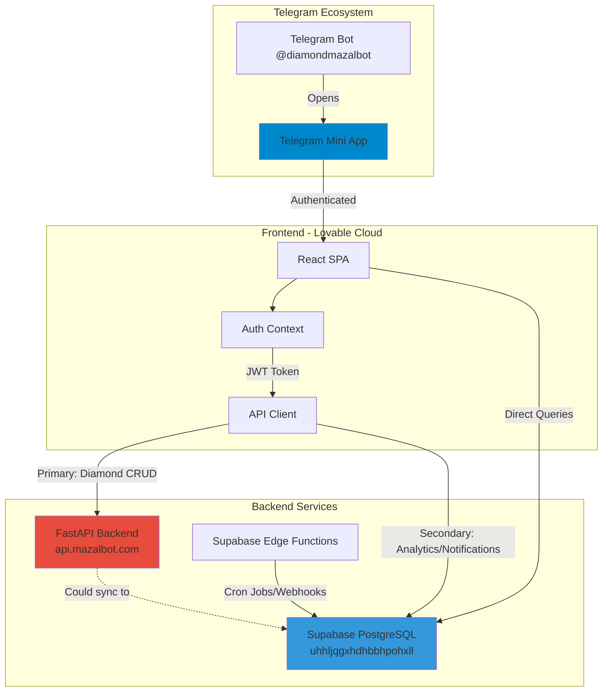
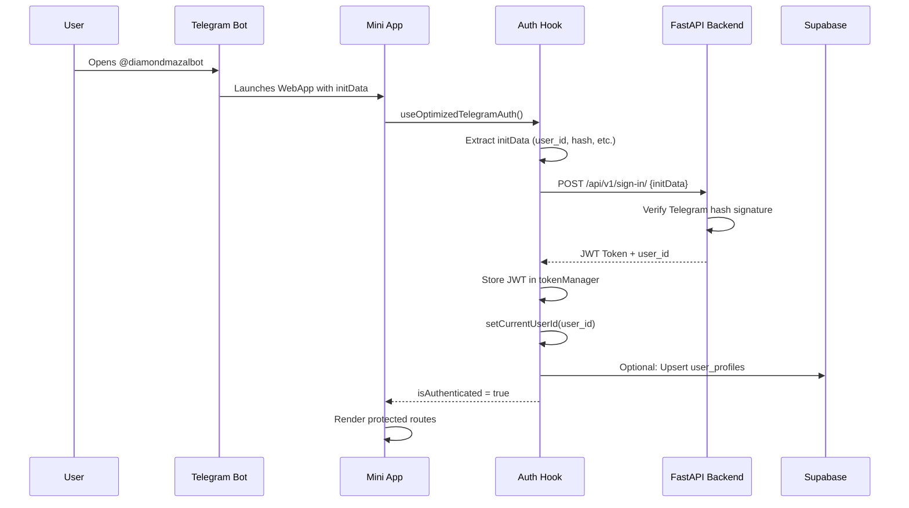
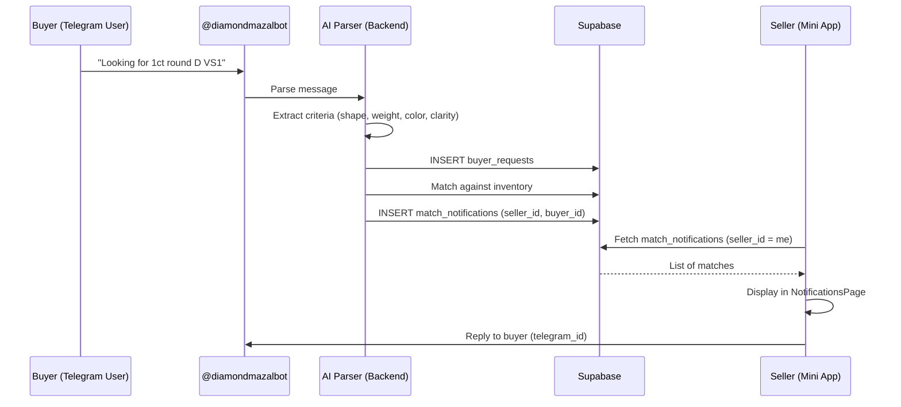
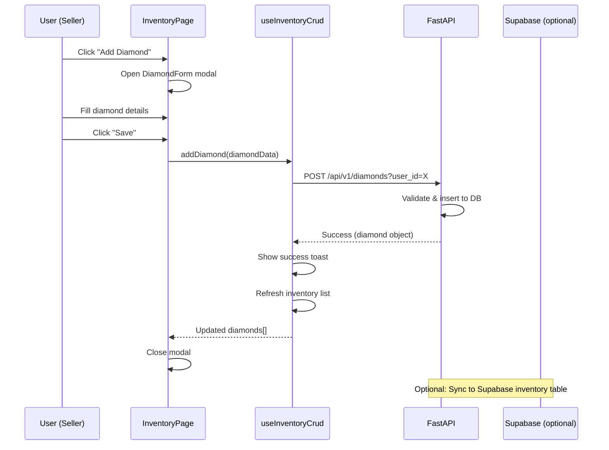
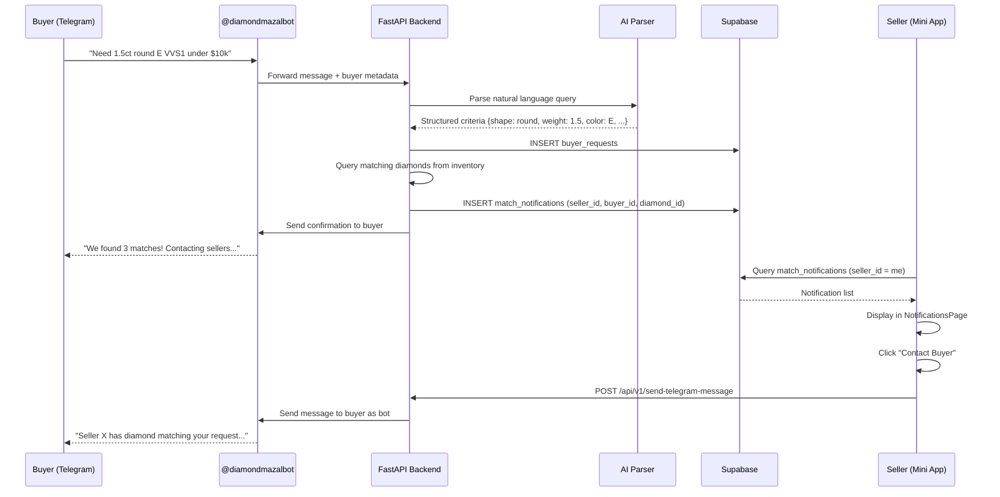

# 🔷 DIAMOND MAZAL BOT - COMPLETE TECHNICAL AUDIT FOR CURSOR AI

## 📋 EXECUTIVE SUMMARY

**Project Type:** Telegram Mini App (Web Application)  
**Primary Stack:** React + TypeScript + Vite + TailwindCSS  
**Backend:** External FastAPI (https://api.mazalbot.com)  
**Database:** Supabase PostgreSQL  
**Authentication:** Telegram WebApp initData + JWT tokens  
**Deployment:** Lovable Cloud (Frontend) + External FastAPI (Backend)

### 🎯 Core Purpose
A diamond inventory management and marketplace platform accessed exclusively through Telegram. Users (diamond sellers) manage inventory via FastAPI backend, while data is also stored/synced with Supabase for advanced features like notifications, analytics, and AI matching.

---

## 🏗️ SYSTEM ARCHITECTURE



### 🔑 Critical Architecture Note
**DUAL DATABASE REALITY:**
- **FastAPI Backend** stores diamond inventory (primary source of truth)
- **Supabase** also has `inventory` table (for analytics, RLS policies, edge functions)
- **Current Issue:** Data is NOT automatically synced between FastAPI and Supabase
- **Access Pattern:** Frontend fetches diamonds from FastAPI (`/api/v1/get_all_stones`), NOT from Supabase `inventory` table directly

---

## 🔐 AUTHENTICATION FLOW



### 🔧 Key Authentication Files
- **`src/lib/api/auth.ts`**: `verifyTelegramUser()`, `signInToBackend()`
- **`src/hooks/useOptimizedTelegramAuth.ts`**: Main auth logic
- **`src/context/TelegramAuthContext.tsx`**: Auth context provider
- **`src/lib/api/tokenManager.ts`**: JWT token storage/management
- **`src/components/auth/AuthenticatedRoute.tsx`**: Route protection

### 🔒 Token Management
```typescript
// JWT stored in memory (tokenManager)
// Access pattern:
getCurrentUserId() // Returns bigint user_id
getBackendAuthToken() // Returns JWT string
```

---

## 📁 PROJECT STRUCTURE

```
src/
├── api/
│   └── http.ts                    # HTTP client wrapper for FastAPI
├── lib/
│   ├── api/
│   │   ├── config.ts              # API_BASE_URL: https://api.mazalbot.com
│   │   ├── auth.ts                # Telegram auth verification
│   │   ├── endpoints.ts           # All FastAPI endpoint definitions
│   │   └── index.ts               # API adapter (data, error) structure
│   └── tokenManager.ts            # JWT token storage
├── context/
│   └── TelegramAuthContext.tsx    # Global auth state
├── hooks/
│   ├── useOptimizedTelegramAuth.ts   # Main auth hook
│   ├── useInventoryData.ts           # Fetch diamonds from FastAPI
│   ├── useStoreData.ts               # Public catalog data
│   ├── useTelegramWebApp.ts          # Telegram SDK wrapper
│   └── inventory/
│       ├── useInventoryCrud.ts       # Diamond CRUD operations
│       └── useOptimizedDelete.ts     # Optimistic delete
├── services/
│   └── inventoryDataService.ts       # fetchInventoryData() - FastAPI call
├── pages/                            # All route components
│   ├── Index.tsx                     # Public landing (/)
│   ├── SimpleDashboard.tsx           # Dashboard (/dashboard)
│   ├── InventoryPage.tsx             # Inventory management (/inventory)
│   ├── CatalogPage.tsx               # Public store (/catalog, /store)
│   ├── NotificationsPage.tsx         # Seller notifications (/notifications)
│   ├── PublicDiamondPage.tsx         # Shareable diamond links (/public/diamond/:stockNumber)
│   └── Admin.tsx                     # Admin panel (/admin)
├── components/
│   ├── auth/                         # Auth guards
│   ├── inventory/                    # Inventory UI components
│   ├── store/                        # Catalog/store UI
│   ├── admin/                        # Admin dashboard
│   └── layout/                       # Layouts (TelegramMiniAppLayout)
└── integrations/
    └── supabase/
        ├── client.ts                 # Supabase client initialization
        └── types.ts                  # Auto-generated DB types (READ-ONLY)
```

---

## 🌐 APPLICATION PAGES & ROUTES

### Public Routes (No Auth Required)
| Route | Component | Purpose |
|-------|-----------|---------|
| `/` | `Index.tsx` | Landing page, redirects to `/dashboard` if authenticated |
| `/public/diamond/:stockNumber` | `PublicDiamondPage.tsx` | Public diamond sharing (no JWT needed) |
| `/privacy-policy` | `PrivacyPolicy.tsx` | Privacy policy for BotFather |

### Authenticated Routes (JWT Required)
| Route | Component | Purpose |
|-------|-----------|---------|
| `/dashboard` | `SimpleDashboard.tsx` | Main dashboard with inventory stats |
| `/inventory` | `InventoryPage.tsx` | Diamond inventory management (CRUD) |
| `/catalog` or `/store` | `CatalogPage.tsx` | Public catalog of diamonds marked `store_visible=true` |
| `/upload` | `UploadPage.tsx` | CSV bulk upload |
| `/upload/bulk` | `BulkUploadPage.tsx` | Enhanced bulk upload |
| `/upload-single-stone` | `UploadSingleStonePage.tsx` | Add individual diamond with QR scanner |
| `/notifications` | `NotificationsPage.tsx` | **🚨 BROKEN**: Seller notifications for buyer requests |
| `/diamond/:stockNumber` | `DiamondDetailPage.tsx` | Diamond detail view |
| `/diamond/:stockNumber/immersive` | `ImmersiveDiamondPage.tsx` | 360° immersive viewer |
| `/shared-diamond/:stockNumber` | `SecureDiamondViewerPage.tsx` | Secure diamond sharing |
| `/analytics` | `AnalyticsPage.tsx` | Diamond analytics dashboard |
| `/analytics/shares` | `DiamondShareAnalytics.tsx` | Share analytics |
| `/insights` | `InsightsPage.tsx` | Market insights |
| `/profile` | `ProfilePage.tsx` | User profile |
| `/settings` | `SettingsPage.tsx` | App settings |

### Admin Routes (JWT + Admin Check)
| Route | Component | Purpose |
|-------|-----------|---------|
| `/admin` | `Admin.tsx` | Admin dashboard |
| `/admin/analytics` | `AdminAnalytics.tsx` | Admin analytics |
| `/admin-stats` | `AdminStatsPage.tsx` | System statistics |

---

## 🔌 FASTAPI BACKEND INTEGRATION

### Base URL Configuration
```typescript
// src/lib/api/config.ts
export const API_BASE_URL = "https://api.mazalbot.com";
```

### 🔥 CRITICAL API ENDPOINTS

#### Authentication
```typescript
POST /api/v1/sign-in/
Body: { init_data: string }
Response: { access_token: string, token_type: "bearer", user_id: number }
```

#### Diamond Management (CRUD)
```typescript
// Fetch all diamonds for user
GET /api/v1/get_all_stones?user_id={userId}&limit={limit}&offset={offset}
Response: DiamondData[]

// Add single diamond
POST /api/v1/diamonds?user_id={userId}
Body: DiamondCreateRequest
Response: DiamondData

// Update diamond
PUT /api/v1/diamonds/{diamondId}?user_id={userId}
Body: DiamondUpdateRequest
Response: DiamondData

// Delete diamond
DELETE /api/v1/delete_stone/{diamondId}?user_id={userId}&diamond_id={diamondId}
Response: { success: boolean }

// Batch upload
POST /api/v1/diamonds/batch?user_id={userId}
Body: { diamonds: DiamondCreateRequest[] }
Response: { created: number, failed: number }
```

#### Search & Matching
```typescript
GET /api/v1/get_search_results?user_id={userId}&query={query}
GET /api/v1/get_search_results_count?user_id={userId}
```

#### Health Check
```typescript
GET /api/v1/alive
Response: { status: "ok" }
```

### HTTP Client Implementation
```typescript
// src/api/http.ts - Wrapper around fetch
export async function http<T>(
  endpoint: string,
  options?: RequestInit
): Promise<T> {
  const token = getBackendAuthToken();
  const headers = {
    'Authorization': token ? `Bearer ${token}` : '',
    'Content-Type': 'application/json',
    ...options?.headers,
  };
  
  const response = await fetch(`${API_BASE_URL}${endpoint}`, {
    ...options,
    headers,
  });
  
  if (!response.ok) throw new Error(`HTTP ${response.status}`);
  return response.json();
}
```

---

## 🗄️ SUPABASE DATABASE SCHEMA

### Critical Understanding
**Diamonds are stored in TWO places:**
1. **FastAPI Backend** - Primary source of truth
2. **Supabase `inventory` table** - Used for RLS policies, analytics, edge functions

**Frontend access pattern:**
- Diamonds fetched from **FastAPI** (`/api/v1/get_all_stones`)
- NOT directly queried from Supabase `inventory` table
- Supabase `inventory` may be stale/outdated

### Core Tables

#### `inventory` (Diamond Inventory)
```sql
CREATE TABLE inventory (
  id UUID PRIMARY KEY DEFAULT gen_random_uuid(),
  user_id BIGINT NOT NULL,  -- Telegram user ID
  stock_number TEXT NOT NULL UNIQUE,
  shape TEXT NOT NULL,
  weight NUMERIC NOT NULL,
  color TEXT NOT NULL,
  clarity TEXT NOT NULL,
  cut TEXT,
  polish TEXT,
  symmetry TEXT,
  price_per_carat INTEGER,
  certificate_number BIGINT,
  lab TEXT,
  picture TEXT,  -- Image URL
  gem360_url TEXT,  -- 360° viewer URL (v360.in, my360.fab, segoma.com)
  v360_url TEXT,
  video_url TEXT,
  certificate_url TEXT,
  store_visible BOOLEAN DEFAULT false,  -- Show in public catalog
  status TEXT DEFAULT 'Available',
  deleted_at TIMESTAMP WITH TIME ZONE,
  created_at TIMESTAMP WITH TIME ZONE DEFAULT NOW(),
  updated_at TIMESTAMP WITH TIME ZONE DEFAULT NOW()
);

-- RLS Policies
-- Users access via session context (app.current_user_id)
-- Admin has full access
```

**Key Fields:**
- `user_id`: Telegram user ID (BIGINT, not UUID)
- `stock_number`: Unique identifier for diamond
- `store_visible`: If true, shown in public catalog (`/catalog`)
- `gem360_url`: 360° viewer URL (Segoma format: `https://segoma.com/v.aspx?type=view&id=X`)

#### `user_profiles` (User Information)
```sql
CREATE TABLE user_profiles (
  id UUID PRIMARY KEY DEFAULT gen_random_uuid(),
  telegram_id BIGINT NOT NULL UNIQUE,  -- Telegram user ID
  first_name TEXT,
  last_name TEXT,
  username TEXT,
  email TEXT,
  phone_number TEXT,
  is_premium BOOLEAN DEFAULT false,
  shares_remaining INTEGER DEFAULT 5,  -- Share quota
  trial_expires_at TIMESTAMP WITH TIME ZONE,
  created_at TIMESTAMP WITH TIME ZONE DEFAULT NOW(),
  updated_at TIMESTAMP WITH TIME ZONE DEFAULT NOW()
);
```

#### `match_notifications` (Buyer-Seller Matching)
```sql
CREATE TABLE match_notifications (
  id UUID PRIMARY KEY DEFAULT gen_random_uuid(),
  seller_id BIGINT NOT NULL,  -- Diamond owner
  buyer_id BIGINT NOT NULL,   -- Interested buyer
  diamond_id TEXT NOT NULL,   -- stock_number
  is_match BOOLEAN DEFAULT true,
  confidence_score NUMERIC DEFAULT 0.8,
  details_json JSONB DEFAULT '{}',
  created_at TIMESTAMP WITH TIME ZONE DEFAULT NOW(),
  updated_at TIMESTAMP WITH TIME ZONE DEFAULT NOW()
);

-- RLS Policies
-- Sellers see matches where seller_id = current_user_id
-- Buyers see matches where buyer_id = current_user_id
```

#### `diamond_offers` (Buyer Offers)
```sql
CREATE TABLE diamond_offers (
  id UUID PRIMARY KEY DEFAULT gen_random_uuid(),
  diamond_stock_number TEXT NOT NULL,
  diamond_owner_telegram_id BIGINT NOT NULL,
  buyer_telegram_id BIGINT NOT NULL,
  buyer_name TEXT,
  buyer_contact TEXT,
  offered_price NUMERIC NOT NULL,
  message TEXT,
  status TEXT DEFAULT 'pending',  -- pending, accepted, rejected
  created_at TIMESTAMP WITH TIME ZONE DEFAULT NOW(),
  responded_at TIMESTAMP WITH TIME ZONE
);
```

#### `diamond_share_analytics` (Share Tracking)
```sql
CREATE TABLE diamond_share_analytics (
  id UUID PRIMARY KEY DEFAULT gen_random_uuid(),
  owner_telegram_id BIGINT NOT NULL,
  diamond_stock_number TEXT NOT NULL,
  viewer_telegram_id BIGINT,
  viewer_ip_address INET,
  view_timestamp TIMESTAMP WITH TIME ZONE DEFAULT NOW(),
  time_spent_seconds INTEGER,
  referrer TEXT,
  session_id UUID
);
```

#### `admin_roles` (Admin Access Control)
```sql
CREATE TABLE admin_roles (
  id UUID PRIMARY KEY DEFAULT gen_random_uuid(),
  telegram_id BIGINT NOT NULL UNIQUE,
  role TEXT DEFAULT 'admin',  -- admin, super_admin
  is_active BOOLEAN DEFAULT true,
  created_at TIMESTAMP WITH TIME ZONE DEFAULT NOW()
);

-- Function: is_admin(telegram_id)
-- Function: is_current_user_admin()
```

#### `buyer_requests` (AI-Parsed Buyer Requests)
```sql
CREATE TABLE buyer_requests (
  id UUID PRIMARY KEY DEFAULT gen_random_uuid(),
  buyer_id BIGINT NOT NULL,
  original_message TEXT,
  extracted_criteria_json JSONB DEFAULT '{}',
  confidence_score NUMERIC DEFAULT 0.8,
  status TEXT DEFAULT 'pending',
  created_at TIMESTAMP WITH TIME ZONE DEFAULT NOW()
);
```

#### `bot_usage_analytics` (Telegram Bot Analytics)
```sql
CREATE TABLE bot_usage_analytics (
  id UUID PRIMARY KEY DEFAULT gen_random_uuid(),
  telegram_id BIGINT NOT NULL,
  chat_id BIGINT NOT NULL,
  message_type TEXT NOT NULL,
  command TEXT,
  response_time_ms INTEGER,
  created_at TIMESTAMP WITH TIME ZONE DEFAULT NOW()
);
```

### Key Database Functions

```sql
-- Get current user telegram_id from JWT
CREATE FUNCTION get_current_user_telegram_id() RETURNS BIGINT;

-- Check if user is admin
CREATE FUNCTION is_admin(telegram_id_param BIGINT) RETURNS BOOLEAN;

-- Check if user is current admin
CREATE FUNCTION is_current_user_admin() RETURNS BOOLEAN;

-- Use share quota (deduct from shares_remaining)
CREATE FUNCTION use_share_quota(
  p_user_telegram_id BIGINT,
  p_diamond_stock_number TEXT
) RETURNS BOOLEAN;

-- Get public diamond count
CREATE FUNCTION get_public_diamond_count() RETURNS INTEGER;
```

---

## 🔔 NOTIFICATIONS SYSTEM (CURRENTLY BROKEN)

### Current Implementation
**Location:** `src/pages/NotificationsPage.tsx`

**Intent:** Show sellers when buyers express interest in their diamonds via:
1. Direct messages to Telegram bot
2. AI-parsed buyer requests stored in `buyer_requests` table
3. Matched with seller's inventory → `match_notifications` table

**Current Query:**
```typescript
// Fetches from Supabase match_notifications table
const { data: notifications } = await supabase
  .from('match_notifications')
  .select('*')
  .eq('seller_id', userTelegramId)
  .order('created_at', { ascending: false });
```

### Data Flow (Intended)


### Current Issues
1. **No data in `match_notifications` table** (likely not populated by backend)
2. **No way to contact buyer** from frontend
3. **Telegram SDK limitations** - Can't initiate DMs from Mini App

### Data Structure
```typescript
interface MatchNotification {
  id: string;
  seller_id: number;      // Diamond owner telegram_id
  buyer_id: number;       // Interested buyer telegram_id
  diamond_id: string;     // stock_number
  is_match: boolean;
  confidence_score: number;
  details_json: {
    buyer_criteria?: any;
    matched_diamond?: any;
    buyer_message?: string;
  };
  created_at: string;
}
```

### How to Fix (for Cursor AI)
1. **Backend must populate `match_notifications`** when buyer sends message
2. **Frontend needs "Contact Buyer" button** that:
   - **WRONG:** Tries to use Telegram SDK (won't work - Mini Apps can't initiate DMs)
   - **CORRECT:** Sends message via backend bot relay:
     ```typescript
     // Call backend endpoint to send Telegram message AS the bot
     POST /api/v1/send-telegram-message
     Body: {
       recipient_telegram_id: buyer_id,
       message: `Seller responded to your diamond request...`,
       from_seller_id: seller_telegram_id
     }
     ```

---

## ⚡ KEY FEATURES

### 1. Inventory Management
- **CRUD operations** via FastAPI
- **CSV bulk upload** (`/upload`, `/upload/bulk`)
- **Single diamond add** with QR scanner (`/upload-single-stone`)
- **Delete diamond** with optimistic UI updates
- **Edit diamond** inline or modal
- **Toggle store visibility** (show/hide in public catalog)

### 2. Public Catalog (`/catalog`)
- Shows diamonds where `store_visible = true`
- **No authentication required** for viewing
- Supports 360° viewers (v360.in, my360.fab, Segoma)
- Diamond detail pages with share functionality

### 3. Diamond Sharing
- **Public share links:** `/public/diamond/:stockNumber`
- **Secure share links:** `/shared-diamond/:stockNumber`
- **Analytics tracking:** Views, time spent, 360° interactions
- **Share quota system:** 5 free shares per user

### 4. 360° Viewer Integration
Supports multiple providers:
- **v360.in**: `https://v360.in/view/xxx`
- **my360.fab**: `https://my360.fab/xxx`
- **Segoma**: `https://segoma.com/v.aspx?type=view&id=X` ⚠️ Currently being debugged

**Detection logic:** `src/hooks/useInventoryData.ts` → `detect360Url()`

### 5. Admin Dashboard
- User management
- System analytics
- Bot usage statistics
- Blocked users management

### 6. AI Features (Partially Implemented)
- Buyer request parsing
- Diamond matching algorithms
- Market insights
- Learning patterns

---

## 📱 TELEGRAM SDK INTEGRATION

### Initialization
```typescript
// src/lib/telegram/telegramWebApp.ts
import WebApp from '@twa-dev/sdk';

export const telegramWebApp = WebApp;

// Available methods:
WebApp.initData          // Authentication data (hash, user, etc.)
WebApp.initDataUnsafe    // Parsed initData object
WebApp.ready()           // Signal ready to Telegram
WebApp.expand()          // Expand to full screen
WebApp.close()           // Close Mini App
WebApp.HapticFeedback    // Haptic feedback
WebApp.BackButton        // Back button control
WebApp.MainButton        // Main button control
WebApp.openTelegramLink  // Open t.me links
```

### Critical Limitation for Notifications
**❌ WRONG APPROACH:**
```typescript
// This will NOT work in Telegram Mini App
WebApp.openTelegramLink(`https://t.me/${username}`);
// Mini Apps CANNOT initiate DMs to other users
```

**✅ CORRECT APPROACH:**
```typescript
// Use backend bot as relay
await fetch(`${API_BASE_URL}/api/v1/send-telegram-message`, {
  method: 'POST',
  headers: {
    'Authorization': `Bearer ${getBackendAuthToken()}`,
    'Content-Type': 'application/json'
  },
  body: JSON.stringify({
    recipient_telegram_id: buyer_telegram_id,
    message: `Seller responded to your request for diamond ${stock_number}...`,
    from_seller_id: getCurrentUserId()
  })
});
```

---

## 🔁 CRITICAL DATA FLOWS (FOR CURSOR AI)

### 1. Fetch User's Diamonds
```typescript
// src/services/inventoryDataService.ts
export async function fetchInventoryData(): Promise<FetchInventoryResult> {
  const userId = getCurrentUserId(); // From tokenManager
  const endpoint = apiEndpoints.getAllStones(userId, 10000, 0);
  // GET https://api.mazalbot.com/api/v1/get_all_stones?user_id=X&limit=10000&offset=0
  const result = await api.get(endpoint);
  return { data: result.data, debugInfo: {...} };
}

// Used by: useInventoryData hook → InventoryPage
```

### 2. Create Individual Diamond
```typescript
// src/hooks/inventory/useInventoryCrud.ts
const addDiamond = async (diamondData: DiamondCreateRequest) => {
  const userId = getCurrentUserId();
  const endpoint = apiEndpoints.createDiamond(userId);
  // POST https://api.mazalbot.com/api/v1/diamonds?user_id=X
  const result = await api.post(endpoint, diamondData);
  
  if (result.error) {
    toast({ title: "Failed to add diamond", variant: "destructive" });
    return;
  }
  
  toast({ title: "✅ Diamond added successfully" });
  // Refresh inventory
  await fetchData();
};
```

### 3. Delete Diamond
```typescript
// src/hooks/inventory/useOptimizedDelete.ts
const deleteDiamond = async (stockNumber: string, diamondId: string) => {
  const userId = getCurrentUserId();
  
  // Optimistic UI update (remove from UI immediately)
  setDiamonds(prev => prev.filter(d => d.stockNumber !== stockNumber));
  
  // Call FastAPI delete endpoint
  const endpoint = apiEndpoints.deleteDiamond(diamondId, userId);
  // DELETE https://api.mazalbot.com/api/v1/delete_stone/{diamondId}?user_id=X&diamond_id=Y
  const result = await api.delete(endpoint);
  
  if (result.error) {
    toast({ title: "❌ Failed to delete diamond", variant: "destructive" });
    // Revert optimistic update
    await fetchData();
  } else {
    toast({ title: "✅ Diamond deleted successfully" });
  }
};
```

### 4. Fetch Seller Notifications (BROKEN)
```typescript
// src/pages/NotificationsPage.tsx
// ⚠️ Currently fetching from Supabase, but table is empty

const fetchNotifications = async () => {
  const userTelegramId = getCurrentUserId();
  
  const { data, error } = await supabase
    .from('match_notifications')
    .select('*')
    .eq('seller_id', userTelegramId)
    .order('created_at', { ascending: false });
  
  if (error) {
    console.error('Failed to fetch notifications:', error);
    return [];
  }
  
  // ⚠️ `data` is always empty because backend doesn't populate this table
  return data;
};

// FIX NEEDED:
// 1. Backend must populate match_notifications when buyer messages bot
// 2. Add "Contact Buyer" button that calls backend bot relay endpoint
```

### 5. Segoma Viewer Integration
```typescript
// src/hooks/useInventoryData.ts
const detect360Url = (item: any): string | undefined => {
  // Check multiple possible fields for Segoma URL
  const possibleFields = [
    item['3D Link'],      // From FastAPI
    item.segoma_url,      // Alternative field
    item.segomaUrl,       // Camelcase variant
    item.gem360Url,       // Generic 360 field
  ];
  
  for (const url of possibleFields) {
    if (url && typeof url === 'string') {
      // Segoma format: https://segoma.com/v.aspx?type=view&id=X
      if (url.includes('segoma.com') || 
          url.includes('v.aspx') || 
          url.includes('type=view')) {
        console.log('✅ SEGOMA URL DETECTED:', url);
        return url;
      }
    }
  }
  
  return undefined;
};

// Segoma viewer component: src/components/store/SegomaViewer.tsx
// Renders iframe with Segoma URL
```

---

## 🌍 ENVIRONMENT & CONFIGURATION

### Frontend (Lovable Cloud)
```bash
# No .env file - configuration in code
```

### Backend (FastAPI)
```bash
API_BASE_URL=https://api.mazalbot.com
# FastAPI handles:
# - Telegram auth verification
# - Diamond CRUD
# - User management
# - (Should handle) Telegram bot message relay
```

### Supabase
```bash
SUPABASE_URL=https://uhhljqgxhdhbbhpohxll.supabase.co
SUPABASE_ANON_KEY=eyJhbGciOiJIUzI1NiIsInR5cCI6IkpXVCJ9...

# Secrets (in Supabase Edge Functions):
TELEGRAM_BOT_TOKEN=<telegram_bot_token>
FASTAPI_BEARER_TOKEN=<backend_access_token>
BACKEND_URL=https://api.mazalbot.com
```

### Telegram Bot Tokens
```bash
TELEGRAM_BOT_TOKEN=<main_bot_token>
CLIENTS_BOT_TOKEN=<clients_bot_token>
SELLERS_BOT_TOKEN=<sellers_bot_token>
```

---

## 📊 DATA FLOW DIAGRAMS

### Diamond Upload Flow


### Buyer-Seller Matching Flow (Intended)


---

## 🔧 IMPORTANT HOOKS & UTILITIES

### `useInventoryData()`
**File:** `src/hooks/useInventoryData.ts`  
**Purpose:** Fetch and process user's diamond inventory from FastAPI  
**Returns:** `{ diamonds, loading, error, handleRefresh, fetchData }`

```typescript
const { diamonds, loading, error } = useInventoryData();
// diamonds: Diamond[] - Processed inventory list
// loading: boolean - Fetch in progress
// error: string | null - Error message
```

### `useTelegramAuth()`
**File:** `src/context/TelegramAuthContext.tsx`  
**Purpose:** Global auth state (user, isAuthenticated, etc.)  
**Returns:** `{ user, isAuthenticated, isLoading, error }`

```typescript
const { user, isAuthenticated } = useTelegramAuth();
// user: { id: number, first_name: string, ... }
// isAuthenticated: boolean
```

### `useToast()`
**File:** `src/hooks/use-toast.ts`  
**Purpose:** Show success/error notifications  

```typescript
const { toast } = useToast();
toast({ title: "Success!", description: "Diamond added" });
toast({ title: "Error", description: "Failed", variant: "destructive" });
```

---

## 🎯 CURSOR AI ACTION ITEMS

### Immediate Priorities

#### 1. Fix Notification System
**Problem:** `NotificationsPage` shows empty list because `match_notifications` table is not populated.

**Solution:**
1. **Backend:** Ensure buyer messages to bot are parsed and stored in `match_notifications`
2. **Backend:** Create endpoint for seller to contact buyer:
   ```python
   @app.post("/api/v1/send-telegram-message")
   async def send_telegram_message(
       recipient_telegram_id: int,
       message: str,
       from_seller_id: int
   ):
       # Use Telegram Bot API to send message AS the bot
       bot_token = os.getenv("TELEGRAM_BOT_TOKEN")
       url = f"https://api.telegram.org/bot{bot_token}/sendMessage"
       payload = {
           "chat_id": recipient_telegram_id,
           "text": f"🔷 Seller response:\n\n{message}\n\n---\nFrom: Seller #{from_seller_id}",
           "parse_mode": "Markdown"
       }
       response = requests.post(url, json=payload)
       return response.json()
   ```
3. **Frontend:** Add "Contact Buyer" button in `NotificationsPage` that calls this endpoint

#### 2. Segoma Viewer Enhancement
**Problem:** Segoma URLs not always detected/displayed correctly.

**Current check:** `src/hooks/useInventoryData.ts` → `detect360Url()`  
**Segoma format:** `https://segoma.com/v.aspx?type=view&id=<ID>`

**Debug users:** 38166518, 2084882603

**Action:**
- Ensure FastAPI returns Segoma URL in consistent field (`3D Link`, `segoma_url`, or `gem360_url`)
- Update detection logic to handle all possible field names
- Test with actual Segoma URLs from these users

#### 3. Delete Diamond - Ensure Success/Failure Feedback
**Current:** `src/hooks/inventory/useOptimizedDelete.ts`

**Verify:**
- Success toast appears on successful delete
- Error toast + revert on failure
- Diamond disappears from UI immediately (optimistic update)
- Check if FastAPI endpoint returns proper response

#### 4. Add Individual Diamond - Success Message
**Current:** `src/hooks/inventory/useInventoryCrud.ts` → `addDiamond()`

**Verify:**
- Success toast appears after POST succeeds
- Failure toast on error
- Form closes on success
- Inventory list refreshes to show new diamond

---

## 🚨 CRUCIAL BACKEND KNOWLEDGE GAPS

### What FastAPI Backend MUST Know:

1. **Diamond Data Format**
   - Frontend expects specific field names: `stock_number`, `shape`, `weight`, `color`, `clarity`, `picture`, `gem360_url`
   - 360° viewer URLs must be in `3D Link`, `segoma_url`, or `gem360_url` field
   - Segoma format: `https://segoma.com/v.aspx?type=view&id=X`

2. **User Identification**
   - All requests use `user_id` query parameter (Telegram user ID as BIGINT)
   - JWT token in `Authorization: Bearer <token>` header
   - Backend should validate JWT contains matching `user_id`

3. **Delete Endpoint Requirements**
   ```python
   DELETE /api/v1/delete_stone/{diamond_id}?user_id={user_id}&diamond_id={diamond_id}
   
   # MUST return:
   { "success": true }  # On success
   { "success": false, "error": "..." }  # On failure
   ```

4. **Notification System**
   - Backend should populate Supabase `match_notifications` table when buyer sends message
   - Backend should provide `/api/v1/send-telegram-message` endpoint for seller-to-buyer contact
   - Cannot rely on frontend Telegram SDK for direct messaging

5. **Supabase Sync (Optional but Recommended)**
   - When diamond CRUD operations happen in FastAPI, consider syncing to Supabase `inventory` table
   - This enables RLS policies, edge functions, and analytics features
   - Sync pattern:
     ```python
     # After creating/updating diamond in FastAPI DB
     supabase.table('inventory').upsert({
         'user_id': user_id,
         'stock_number': stock_number,
         'shape': shape,
         # ... other fields
     }).execute()
     ```

---

## 📚 QUICK REFERENCE

### Key API Endpoints (FastAPI)
```bash
# Auth
POST /api/v1/sign-in/

# Diamonds
GET /api/v1/get_all_stones?user_id=X&limit=Y&offset=Z
POST /api/v1/diamonds?user_id=X
PUT /api/v1/diamonds/{id}?user_id=X
DELETE /api/v1/delete_stone/{id}?user_id=X&diamond_id=Y
POST /api/v1/diamonds/batch?user_id=X

# Search
GET /api/v1/get_search_results?user_id=X&query=Y
GET /api/v1/get_search_results_count?user_id=X

# Health
GET /api/v1/alive
```

### Key Files to Understand
```bash
src/lib/api/config.ts              # API base URL
src/lib/api/auth.ts                # Telegram authentication
src/lib/api/endpoints.ts           # All endpoint definitions
src/services/inventoryDataService.ts  # Main data fetching
src/hooks/useInventoryData.ts      # Inventory hook
src/hooks/inventory/useInventoryCrud.ts  # CRUD operations
src/pages/InventoryPage.tsx        # Main inventory UI
src/pages/NotificationsPage.tsx    # Seller notifications (broken)
src/components/store/SegomaViewer.tsx  # Segoma 360° viewer
```

### Supabase Direct Queries (if needed)
```typescript
import { supabase } from "@/integrations/supabase/client";

// Get public diamonds
const { data } = await supabase
  .from('inventory')
  .select('*')
  .eq('store_visible', true)
  .is('deleted_at', null);

// Get user notifications
const { data } = await supabase
  .from('match_notifications')
  .select('*')
  .eq('seller_id', userTelegramId);
```

---

## ⚠️ COMMON PITFALLS FOR CURSOR AI

1. **Don't query Supabase `inventory` directly for user diamonds**
   - Always use FastAPI endpoint (`/api/v1/get_all_stones`)
   - Supabase `inventory` may be stale

2. **Don't try to send Telegram messages from frontend**
   - Telegram Mini App SDK cannot initiate DMs
   - Must use backend bot relay endpoint

3. **Don't forget `user_id` parameter**
   - All FastAPI endpoints require `?user_id=X` query param
   - Get it via `getCurrentUserId()` from tokenManager

4. **Don't modify `src/integrations/supabase/types.ts`**
   - This file is auto-generated from Supabase schema
   - Read-only, will be overwritten

5. **Don't assume real-time sync between FastAPI and Supabase**
   - Data may be inconsistent
   - Frontend always fetches from FastAPI for diamonds
   - Supabase used for notifications, analytics, admin features

6. **Don't hardcode user IDs or admin checks**
   - Use `is_current_user_admin()` Supabase function
   - Use `getCurrentUserId()` for current user

7. **Always show user feedback**
   - Use `toast()` for success/error messages
   - Show loading states during API calls
   - Optimistic updates for better UX

---

## 🔗 USEFUL LINKS

- **Telegram Bot:** [@diamondmazalbot](https://t.me/diamondmazalbot)
- **FastAPI Docs:** https://api.mazalbot.com/docs
- **Supabase Dashboard:** https://supabase.com/dashboard/project/uhhljqgxhdhbbhpohxll
- **Telegram Mini App Docs:** https://core.telegram.org/bots/webapps
- **Telegram Bot API:** https://core.telegram.org/bots/api

---

## 📝 SUMMARY FOR CURSOR AI

**TL;DR:**
- Frontend: React + Vite + TailwindCSS (Telegram Mini App)
- Backend: FastAPI (https://api.mazalbot.com) - stores diamonds
- Database: Supabase (analytics, notifications, admin)
- Auth: Telegram initData → JWT token
- **Diamonds accessed via FastAPI, NOT Supabase directly**
- **Notification system currently broken** (empty `match_notifications` table)
- **Segoma viewer integration** being debugged for specific users
- **Key issue:** Frontend can't send Telegram messages - need backend bot relay

**Your mission:**
1. Ensure delete/add diamond operations show proper success/failure messages
2. Fix notification system (backend must populate `match_notifications` + provide bot relay endpoint)
3. Debug Segoma viewer URL detection for users 38166518 and 2084882603
4. Always use `getCurrentUserId()` for authenticated requests
5. Always show user feedback with `toast()`

---

*Last updated: 2025-10-30*
*Project: Diamond Mazal Bot - Telegram Mini App*
*For: Cursor AI Backend Integration*
