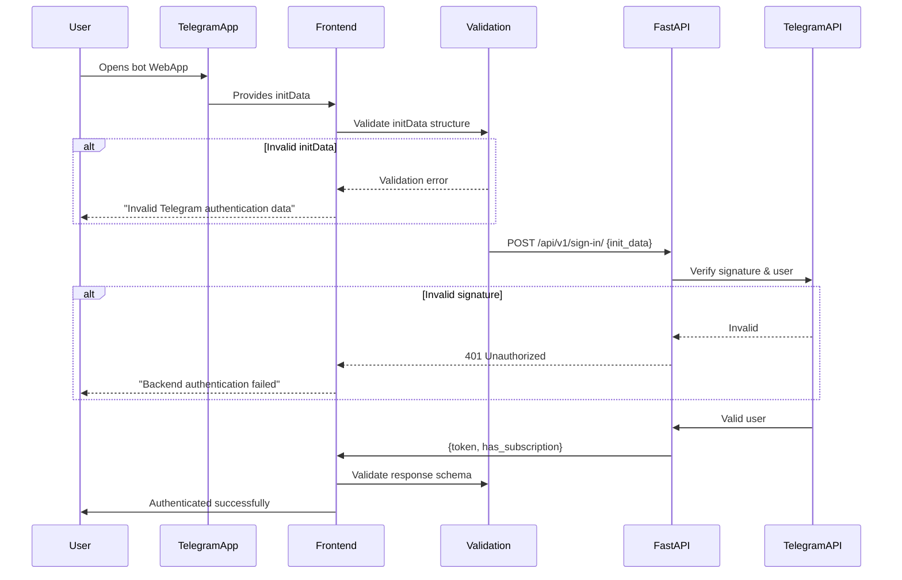

# Telegram InitData Security Implementation

## Overview
This document describes the comprehensive security implementation for Telegram WebApp authentication using the FastAPI `/api/v1/sign-in/` endpoint.

## Security Architecture

### 1. Client-Side Validation (First Layer)
**File:** `src/lib/api/validation.ts`

All Telegram initData is validated **before** being sent to the backend:

✅ **Minimum Length Check**: InitData must be at least 50 characters
✅ **Maximum Length Check**: InitData cannot exceed 10,000 characters  
✅ **Required Fields Validation**: Must contain `user`, `hash`, and `auth_date` parameters
✅ **Structure Validation**: Must be valid URL-encoded query string format
✅ **User Data Extraction**: Validates user ID and first name are present

### 2. Backend Authentication (Second Layer)
**Endpoint:** `POST /api/v1/sign-in/`

The FastAPI backend performs cryptographic validation:

✅ **Signature Verification**: Validates the Telegram hash signature
✅ **Timestamp Validation**: Ensures initData is not expired
✅ **Replay Attack Prevention**: Checks for duplicate requests
✅ **User Authentication**: Verifies the user with Telegram servers

**Request Format:**
```json
{
  "init_data": "query_id=...&user=...&auth_date=...&hash=..."
}
```

**Response Format:**
```json
{
  "token": "eyJhbGciOiJIUzI1NiIsInR5cCI6IkpXVCJ9...",
  "has_subscription": true
}
```

### 3. Response Validation (Third Layer)
**File:** `src/lib/api/validation.ts`

Backend responses are validated using Zod schemas:

✅ **Token Validation**: Ensures JWT token is present and non-empty
✅ **Subscription Status**: Validates boolean subscription flag
✅ **Type Safety**: TypeScript types enforce correct response structure

## Authentication Flow



## Security Features Implemented

### 1. No Dev Mode Bypass in Production
**File:** `src/hooks/useOptimizedTelegramAuth.ts` (Lines 76-82)

```typescript
// CRITICAL: Dev mode ONLY works on localhost (NOT on production lovable.app)
const isPreviewMode = window.location.hostname === 'localhost' || 
                     window.location.hostname === '127.0.0.1' ||
                     window.location.hostname.endsWith('.local');
```

❌ **Blocked:** `https://yourapp.lovable.app?test_user_id=123`  
✅ **Allowed:** `http://localhost:5173?test_user_id=123` (dev only)

### 2. Strict InitData Validation
**File:** `src/hooks/useOptimizedTelegramAuth.ts` (Lines 138-149)

```typescript
// STRICT initData validation - must have minimum length and required fields
if (!tg.initData || tg.initData.length < 50) {
  throw new Error('no_init_data');
}

// Validate initData structure contains required Telegram fields
const initDataParams = new URLSearchParams(tg.initData);
if (!initDataParams.get('user') || !initDataParams.get('hash') || !initDataParams.get('auth_date')) {
  throw new Error('invalid_init_data');
}
```

### 3. Cached Authentication Verification
**File:** `src/hooks/useOptimizedTelegramAuth.ts` (Lines 22-49)

Cached authentication is validated to ensure Telegram environment still has valid initData:

```typescript
const cachedAuth = tokenManager.getCachedAuthState();
if (cachedAuth && tokenManager.isValid()) {
  // Verify we still have valid Telegram environment with initData
  if (!window.Telegram?.WebApp?.initData) {
    console.warn('⚠️ AUTH: Cached auth exists but no initData - clearing cache');
    tokenManager.clear();
    // Force fresh authentication
  }
}
```

### 4. Centralized Authentication
**File:** `src/lib/api/auth.ts`

All authentication flows use the `signInToBackend()` function:
- ✅ `useOptimizedTelegramAuth.ts` - Main app authentication
- ✅ `useGroupCTARegistration.ts` - Group CTA registration
- ✅ `useGroupCTATracking.ts` - Group CTA tracking

This ensures:
- Consistent validation across all entry points
- No alternative authentication methods
- Single source of truth for security rules

### 5. Input Validation with Zod
**File:** `src/lib/api/validation.ts`

Using industry-standard Zod library for schema validation:

```typescript
export const telegramInitDataSchema = z.string()
  .min(50, 'InitData must be at least 50 characters')
  .max(10000, 'InitData exceeds maximum length')
  .refine((data) => {
    const params = new URLSearchParams(data);
    return params.has('user') && params.has('hash') && params.has('auth_date');
  }, 'InitData must contain valid Telegram authentication parameters');
```

## Security Testing Checklist

### ✅ Valid Authentication Flow
1. Open Telegram app
2. Navigate to your bot
3. Click menu button to open WebApp
4. Should authenticate successfully via JWT
5. Check console logs:
   - `✅ MAIN AUTH: Client-side initData validation passed`
   - `✅ MAIN AUTH: Backend response validation passed`
   - `✅ MAIN AUTH: JWT token received and stored`

### ❌ Block Direct Browser Access
1. Open `https://yourapp.lovable.app` in Chrome (not Telegram)
2. Should see "This app only works inside Telegram WebApp"
3. Should NOT authenticate

### ❌ Block Dev Mode Exploit on Production
1. Try: `https://yourapp.lovable.app?test_user_id=999`
2. Should show "This app only works inside Telegram WebApp"
3. Should NOT bypass authentication

### ❌ Block Invalid InitData
1. Modify WebApp SDK to send invalid initData (missing hash)
2. Check console logs:
   - `❌ MAIN AUTH: Client-side validation failed`
3. Should NOT reach backend

### ❌ Backend Signature Validation
1. Modify initData hash to invalid value
2. Backend should return 401 Unauthorized
3. Check console logs:
   - `❌ MAIN AUTH: Backend authentication failed - invalid Telegram signature`

## Error Messages

| Error Code | Message | Meaning |
|------------|---------|---------|
| `no_init_data` | Missing Telegram authentication data | InitData is empty or too short |
| `invalid_init_data` | Invalid Telegram authentication data | InitData missing required fields |
| `not_telegram_environment` | This app only works inside Telegram WebApp | Not running in Telegram WebApp |
| `backend_auth_failed` | Backend authentication failed | Backend rejected the initData |
| `invalid_user_data` | Invalid user data | Cannot extract user from initData |

## Monitoring & Logging

All authentication attempts are logged with:
- ✅ InitData validation status
- ✅ Backend response status
- ✅ User ID extraction status
- ✅ Token storage status
- ✅ Session context setup status

Look for these log patterns:
```
🔐 MAIN AUTH: Starting FastAPI backend authentication
✅ MAIN AUTH: Client-side initData validation passed
🔐 MAIN AUTH: Calling backend sign-in endpoint
✅ MAIN AUTH: Backend response validation passed
✅ MAIN AUTH: JWT token received and stored
```

## Security Best Practices

1. **Never Log InitData**: InitData contains sensitive authentication information
2. **Always Use HTTPS**: Only allow secure connections in production
3. **Validate Both Sides**: Client-side AND server-side validation required
4. **Use TypeScript**: Strong typing prevents type-related vulnerabilities
5. **Centralize Authentication**: Single authentication function for consistency
6. **Cache Validation**: Verify cached auth is still valid before using
7. **Clear Error Messages**: Help users understand authentication failures

## Backend Requirements

Your FastAPI backend must:
1. ✅ Validate Telegram hash signature cryptographically
2. ✅ Check initData timestamp (typically < 5 minutes old)
3. ✅ Prevent replay attacks (track used hashes)
4. ✅ Return proper error codes (401 for auth failure, 422 for validation)
5. ✅ Issue JWT tokens with appropriate expiration
6. ✅ Include subscription status in response

## Additional Security Measures

Consider implementing:
- [ ] Rate limiting on `/api/v1/sign-in/` endpoint
- [ ] IP-based throttling for repeated failures
- [ ] JWT token refresh mechanism
- [ ] Session expiration warnings
- [ ] Automatic re-authentication on token expiry
- [ ] Analytics tracking for failed auth attempts

## Support & Troubleshooting

If users cannot authenticate:
1. Check they're opening via Telegram (not browser)
2. Verify BotFather WebApp URL is correct
3. Check browser console for specific error messages
4. Verify backend is receiving valid initData
5. Check backend logs for signature validation errors

---

**Security Version:** 1.0  
**Last Updated:** 2025-01-29  
**Maintained By:** Development Team
